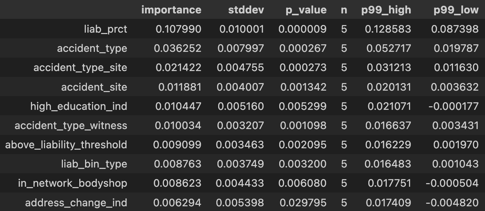

# Subrogation Prediction Project

## Overview
This project is part of the `2025 Travelers UMC TriGuard Insurance Company Modeling Problem`. The objective is to develop machine learning models to predict the likelihood of subrogation for insurance claims. This includes exploratory analysis, data cleaning, model experimentation, and an inference for subrogation predictions.

---

## Objectives
- Identify patterns in insurance data related to subrogations
- Handle data issues and class imbalances
- Evaluate and compare different models and ensembles  
- Predict subrogation outcomes using claim data based on f1 performance
- Produce explainable and accurate predictions for real world data  

---

## Data
The following files were given:
- `train.csv` — includes the target column `subrogation`
- `predict.csv` — unlabeled dataset used for prediction
The files are renamed for general usage purposes.

Some feature categories:
- Claims information (ids, dates, estimated liability)
- Financial information (estimated payouts, damages)
- Policy and coverage details (in / out of insurance policies)
- Event incident information (witness, police indicators)
- Geographic data (zip codes)

The data did not include detailed writeups of the events (text attributes), only basic structured fact features.

---

## Methods

Since the main focus was accurate prediction of subrogation claims, a broad spectrum of models was evaluated to determine the most robust approach for subrogation prediction. Each model type provided different performance characteristics and insights. Below are a few of the models evaluated during training, including but not limited to:

#### 1. **Logistic Regression (Baseline)**
- Provides interpretable coefficients
- Useful as a baseline for future models  
- F1 performance significantly lower than tree and ensemble methods, possible due to underfitting nonlinear relationships

#### 2. **Random Forest**
- Good mix between model complexity and explainability 
- Provides feature importance  
- Handles nonlinear relationships and mixed data types  
- Possibly lower ranking than boosting methods on tabular data  

#### 3. **Gradient Boosting Models**
Boosting methods were central to experimentation due to their strong performance on tabular insurance data:
- **XGBoost**  
- **LightGBM**  
- **CatBoost**  
- Each performed well and had few differences

#### 4. **Neural Network (Non-Bayesian)**
- Fully connected feed-forward network  
- Performed reasonably but required extensive tuning 
- Less stable than boosting methods, prone to overfitting  
- Relatively expensive compute

#### 5. **Bayesian Neural Network (BNN)**
Bayesian methods were also explored to investigate parameter uncertainty and provide more informative probability estimates for subrogation events. Unlike traditional neural networks, BNNs allow the model to express uncertainty in its predictions through learning distributions over feature weights.

Architecture:
- 64–128 units per layer  
- LeakyReLU / SELU activations  
- Bayesian layers with learned distributions  
- Learning rate tuning and early stopping  

Results:
- Achieved moderate F1 results and provided useful insights, but fell short of boosting ensembles in terms of predictive strength.

While these methods may prove useful in future exploration, for the sake of the problem, the models chosen were the ones that provided the strongest f1 scores.

### 6. AutoGluon-Tabular and TabNet

Two advanced tabular modeling frameworks were explored in depth: **AutoGluon-Tabular** and **TabNet**. Both are designed specifically for tabular structured datasets, and often provide better results than the traditional tabular ML methods explored above.

---

#### **TabNet**
TabNet is a deep learning framework developed at Google. It uses sequential attention to determine its features at each step, providing interpretability on feature importance.

**Results**
- Provided built in feature interpretability 
- Handled mixed numerical/categorical data without needing preprocessing
- Designed to capture complex interactions in structured datasets  
- However, it was sensitive to hyperparameters like learning rate and batch size.
- Slower and expensive training compute compared to boosting models  
- F1 results were similar or behind ensemble approaches on this dataset.  

--- 
#### **AutoGluon-Tabular (Final Model)**
AutoGluon-Tabular is a ML framework for tabular data developed by AWS. It trains many strong tabular models (logistic regression, random forests, LightGBM, CatBoost, XGBoost, neural nets, etc.) and builds optimized ensembles from those results. It consistently delivered the strongest results and was thus selected as the final production model. 

**Results**
- Built in model hyperparameter optimization
- Provided robust preprocessing for categorical and missing data.
- Required little to no manual tuning
- Showed leaderboard of all models used in final ensemble 
- Produced the highest and most stable F1 score, outperforming other models

AutoGluon is a state of the art framework for structured tabular data and accordingly provided the best results for subrogation prediction.

---

## Results

- **Best AutoGluon F1:** ~0.6
- **Standalone Gradient Boosting F1:** ~0.55–0.58 depending on model / tuning  

### AutoGluon Leaderboard

These are the top 10 features as provided by AutoGluon. Based on the model results, they are the most impactful on subrogation claims, and further exploration on more data can help inform claim opportunities and resource allocation in real world cases.

---

## Repository Files

- `01_training.ipynb`: training and testing pipeline for AutoGluon
- `02_inference.ipynb`: using Autogluon model to predict future subrogation outcomes

---

## Summary
This project explores a diverse set of models for predicting subrogation outcomes in insurance claims. After experimenting with standard industry-level models, AutoGluon  delivered the strongest and most consistent results, outperforming standalone gradient boosting models and other deep learning approaches.

The project demonstrates a practical pipeline for interpreting and predicting subrogation opportunities in auto insurance claims. It can be extended for general usage in imbalanced classification problems that involve complex relationships with minimal data features.
